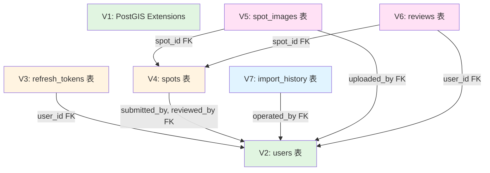

# 資料表依賴關係圖

## Mermaid 圖表

## 依賴層級結構

### Level 0: 基礎設施
- **V1**: PostGIS Extensions (無依賴)

### Level 1: 核心資料表
- **V2**: users 表 (無依賴，除 V1 extensions)

### Level 2: 一級依賴表
- **V3**: refresh_tokens → users
- **V4**: spots → users  
- **V7**: import_history → users

### Level 3: 二級依賴表
- **V5**: spot_images → spots, users
- **V6**: reviews → spots, users

## Foreign Key 關係詳情

### users 表作為被依賴表
1. **refresh_tokens.user_id** → users.id (CASCADE DELETE)
2. **spots.submitted_by** → users.id (SET NULL)
3. **spots.reviewed_by** → users.id (SET NULL)
4. **spot_images.uploaded_by** → users.id (SET NULL)
5. **reviews.user_id** → users.id (CASCADE DELETE)
6. **import_history.operated_by** → users.id (SET NULL)

### spots 表作為被依賴表
1. **spot_images.spot_id** → spots.id (CASCADE DELETE)
2. **reviews.spot_id** → spots.id (CASCADE DELETE)

## 關鍵發現

✅ **無循環依賴**: 所有依賴關係形成 DAG (有向無環圖)
✅ **正確執行順序**: V1 → V2 → V3,V4,V7 → V5,V6
✅ **合理刪除策略**: CASCADE 用於強關聯，SET NULL 用於可空關聯
✅ **資料完整性**: 所有必要 FK 約束已建立