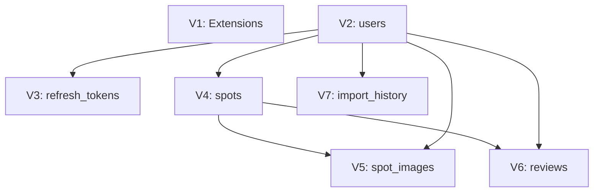

# 遷移檔案命名規則與依賴檢查要點

## 檔案命名規則

### 基本格式
```
V{version}__{description}.sql
```

### 命名要素

#### 1. 版本號 (`{version}`)
- **格式**: 遞增整數 (V1, V2, V3, V8, V9, V10...)
- **規則**:
  - ✅ 必須連續遞增，禁止跳號
  - ✅ 使用大寫 `V` 前綴
  - ❌ 禁止使用小寫 `v`
  - ❌ 禁止使用時間戳記 (20231215, 1.0, etc.)
  - ❌ 禁止重複版本號

#### 2. 描述 (`{description}`)
- **格式**: 小寫字母與底線
- **長度**: 建議不超過 50 字元
- **規則**:
  - ✅ 使用 snake_case 命名
  - ✅ 描述應清楚表達變更內容
  - ✅ 使用動詞開頭 (create, add, alter, remove)
  - ❌ 禁止使用大寫字母
  - ❌ 禁止使用連字符 (-)
  - ❌ 禁止使用空格

#### 3. 副檔名
- **固定**: `.sql`
- **大小寫**: 小寫

### 命名範例

#### ✅ 正確命名
```
V1__enable_postgis.sql
V2__create_users.sql
V3__create_refresh_tokens.sql
V4__create_spots.sql
V5__create_spot_images.sql
V6__create_reviews.sql
V7__create_import_history.sql
V8__create_user_profiles.sql
V9__add_profile_image_to_users.sql
V10__add_spots_performance_indexes.sql
V11__alter_reviews_add_helpful_count.sql
```

#### ❌ 錯誤命名
```
v1__enable_postgis.sql              # 小寫 v
V1_enable_postgis.sql               # 缺少雙底線
V1.1__enable_postgis.sql            # 版本號格式錯誤
20231215__enable_postgis.sql        # 使用時間戳記
V1__CreateUsers.sql                 # 大寫字母
V1__create-users.sql                # 使用連字符
V1__create users.sql                # 使用空格
V9__skip_V10.sql                    # 跳號 (V8 之後應接 V9)
V5__create_users.sql                # 重複版本號
```

### 命名慣例建議

#### 按操作類型分類
```sql
-- 建立資料表
V{version}__create_{table_name}.sql

-- 新增欄位
V{version}__add_{column_name}_to_{table_name}.sql

-- 修改欄位
V{version}__alter_{table_name}_{column_name}.sql

-- 建立索引
V{version}__add_{table_name}_indexes.sql

-- 新增約束
V{version}__add_{constraint_type}_to_{table_name}.sql

-- 資料遷移
V{version}__migrate_{entity}_data.sql

-- 刪除項目
V{version}__remove_{item}_from_{table_name}.sql
```

#### 複雜變更命名
```sql
-- 多項變更
V12__enhance_spot_management.sql

-- 重大功能
V13__implement_booking_system.sql

-- 效能優化
V14__optimize_query_performance.sql
```

## 依賴關係檢查要點

### 1. 版本依賴順序

#### 基本原則
- **被依賴的遷移先執行**
- **依賴他人的遷移後執行**
- **循環依賴絕對禁止**

#### 依賴層級
```
Level 0: 基礎設施 (無依賴)
└── V1: extensions

Level 1: 核心資料表
└── V2: users

Level 2: 一級依賴表
├── V3: refresh_tokens → users
├── V4: spots → users
└── V7: import_history → users

Level 3: 二級依賴表
├── V5: spot_images → spots + users
└── V6: reviews → spots + users
```

### 2. Foreign Key 依賴檢查

#### 檢查清單
```sql
-- 對於每個 FK constraint，必須確認：
CONSTRAINT fk_{table}_{ref_table}
    FOREIGN KEY (fk_column)
    REFERENCES {ref_table} ({ref_column})

-- 檢查項目：
-- 1. {ref_table} 是否在先前版本建立？
-- 2. {ref_column} 是否存在於該資料表？
-- 3. FK 版本號 > ref_table 版本號？
```

#### 實例檢查
```sql
-- V3__create_refresh_tokens.sql
CONSTRAINT fk_refresh_tokens_user
    FOREIGN KEY (user_id) REFERENCES users (id)

-- ✅ 檢查通過：
--    - users 表存在 (V2 建立)
--    - id 欄位存在於 users
--    - V3 > V2 (版本順序正確)

-- V5__create_spot_images.sql
CONSTRAINT fk_spot_images_spot
    FOREIGN KEY (spot_id) REFERENCES spots (id)

-- ✅ 檢查通過：
--    - spots 表存在 (V4 建立)
--    - id 欄位存在於 spots
--    - V5 > V4 (版本順序正確)
```

### 3. 隱含依賴檢查

#### 索引依賴
```sql
-- 索引建立在資料表之後
-- V8__create_user_profiles.sql
CREATE TABLE user_profiles (...);      -- 先建立表
CREATE INDEX ix_user_profiles_user_id   -- 後建立索引
    ON user_profiles (user_id);
```

#### 資料類型依賴
```sql
-- PostGIS 類型依賴 extension
-- V1__enable_postgis.sql
CREATE EXTENSION IF NOT EXISTS postgis;  -- 先啟用 extension

-- V4__create_spots.sql
location geometry(Point, 4326)           -- 後使用 PostGIS 類型
```

#### 函數依賴
```sql
-- 如果使用自訂函數，需先建立函數
-- V9__create_user_functions.sql
CREATE FUNCTION calculate_age(birth_date DATE) ...

-- V10__add_calculated_fields.sql
age INTEGER GENERATED ALWAYS AS (calculate_age(birth_date)) STORED
```

### 4. 依賴檢查流程

#### 自動檢查指令
```bash
# 方法 1: 使用 Flyway 驗證
flyway validate

# 方法 2: 試執行遷移 (dry run)
flyway migrate -dryRun=true

# 方法 3: 檢查遷移資訊
flyway info
```

#### 手動檢查步驟
```bash
# 1. 列出所有遷移檔案
ls -la db/migration/V*.sql | sort

# 2. 依序讀取每個檔案
# 3. 記錄每個檔案建立的資料表
# 4. 繪製依賴關係圖
# 5. 確認無循環依賴
# 6. 驗證 FK 引用順序
```

### 5. 常見依賴錯誤

#### ❌ 向前引用錯誤
```sql
-- V3__create_orders.sql (錯誤)
CONSTRAINT fk_orders_customer
    FOREIGN KEY (customer_id) REFERENCES customers (id)
-- customers 表不存在！應在 V3 之前建立
```

#### ❌ 循環依賴錯誤
```sql
-- V4__create_table_a.sql
FK table_b_id REFERENCES table_b(id)

-- V5__create_table_b.sql
FK table_a_id REFERENCES table_a(id)
-- 循環依賴！無法決定執行順序
```

#### ❌ 跨依賴錯誤
```sql
-- V6__create_orders.sql
FK customer_id REFERENCES customers(id)     -- customers 在 V7
FK product_id REFERENCES products(id)       -- products 在 V8
-- 無法決定先建立 orders 還是先建立 customers/products
```

## 依賴關係圖繪製

### 文字表示法
```
V1 (extensions)
 ↓
V2 (users)
 ↓←←←←←←←←←←↓
V3 (tokens)   V4 (spots)
              ↓
         ←←←←↓
         V5 (images)
         V6 (reviews)

V2 (users) → V7 (import_history)
```

### Mermaid 圖表示法


## 驗證工具

### 自動化檢查腳本
```bash
#!/bin/bash
# migration-dependency-check.sh

echo "檢查 Flyway 遷移依賴關係..."

# 檢查版本號連續性
versions=$(ls db/migration/V*.sql | sed 's/.*V\([0-9]*\)__.*/\1/' | sort -n)
prev=0
for v in $versions; do
    if [ $v -ne $((prev + 1)) ]; then
        echo "❌ 版本號不連續: V$prev → V$v"
        exit 1
    fi
    prev=$v
done
echo "✅ 版本號連續性檢查通過"

# 檢查檔案命名格式
for file in db/migration/V*.sql; do
    if [[ ! $file =~ ^db/migration/V[0-9]+__[a-z_]+\.sql$ ]]; then
        echo "❌ 檔案命名格式錯誤: $file"
        exit 1
    fi
done
echo "✅ 檔案命名格式檢查通過"

# 檢查 Flyway 設定
if flyway validate 2>&1 | grep -q "Validate succeeded"; then
    echo "✅ Flyway 驗證通過"
else
    echo "❌ Flyway 驗證失敗"
    exit 1
fi

echo "✅ 所有依賴關係檢查通過"
```

## 快速參考

### 命名規則速查
| 元素 | 格式 | 範例 |
|------|------|------|
| 版本號 | V{整數} | V1, V8, V12 |
| 描述 | {小寫+底線} | create_users, add_status_to_reviews |
| 副檔名 | .sql | .sql |
| 完整格式 | V{n}__{desc}.sql | V8__create_user_profiles.sql |

### 依賴檢查清單
- [ ] 版本號連續不跳號
- [ ] 描述使用 snake_case
- [ ] FK 引用先前建立的資料表
- [ ] 無循環依賴
- [ ] 索引建立在資料表之後
- [ ] 特殊類型依賴的 extension/函數已建立
- [ ] Flyway validate 通過

### 常用指令
```bash
# 檢查遷移狀態
flyway info

# 驗證遷移檔案
flyway validate

# 試執行遷移
flyway migrate -dryRun=true

# 檢查資料表結構
psql -c "\dt"
psql -c "\d {table_name}"

# 查看遷移歷史
psql -c "SELECT * FROM flyway_schema_history ORDER BY installed_rank;"
```